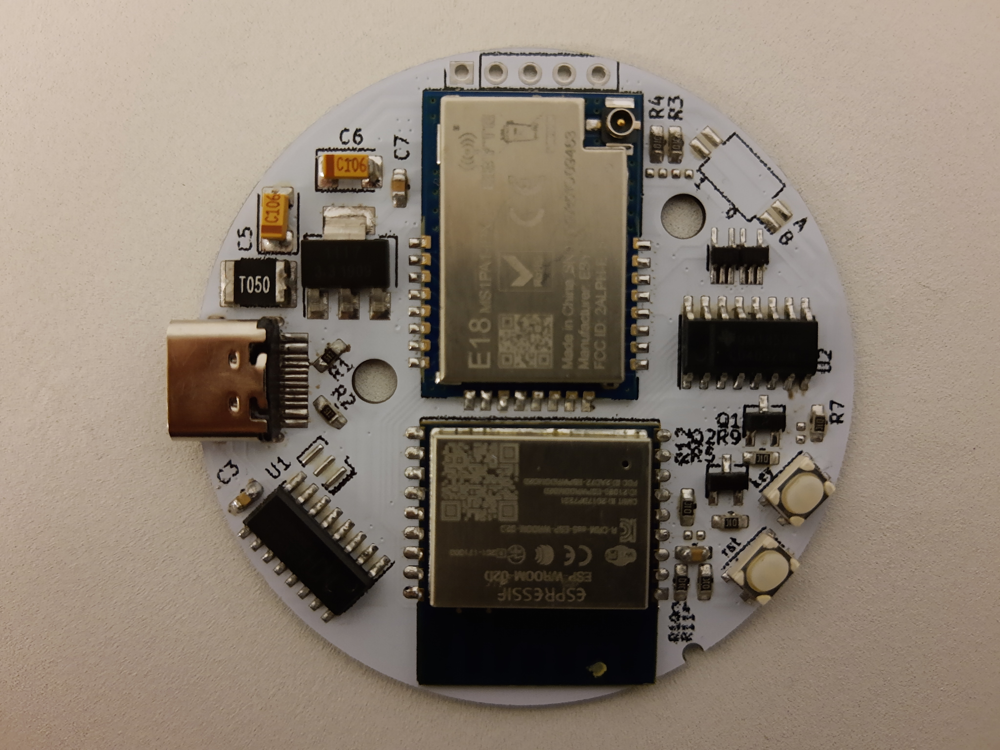
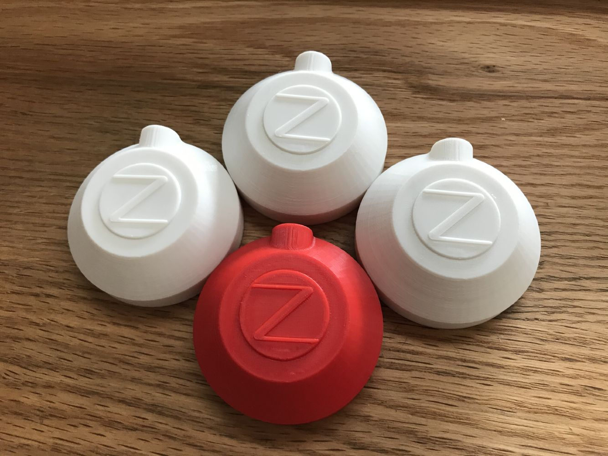
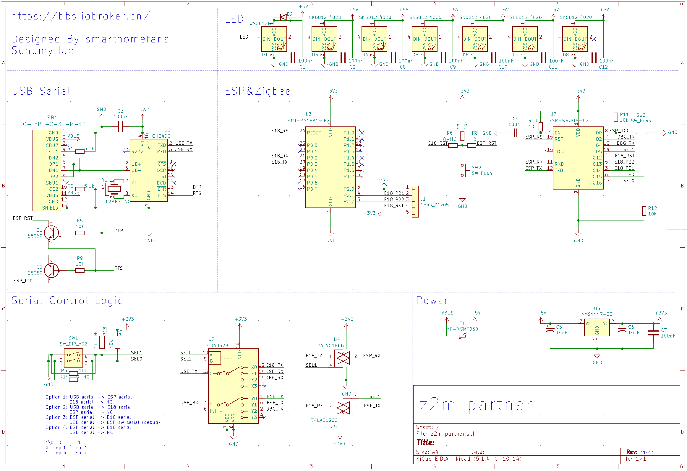
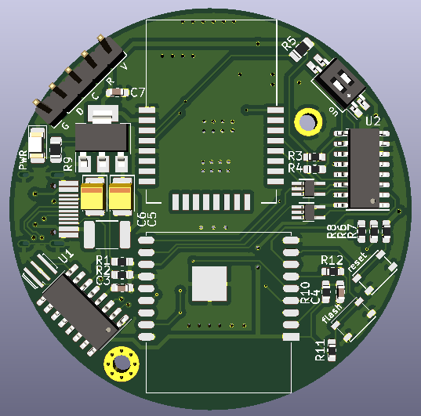
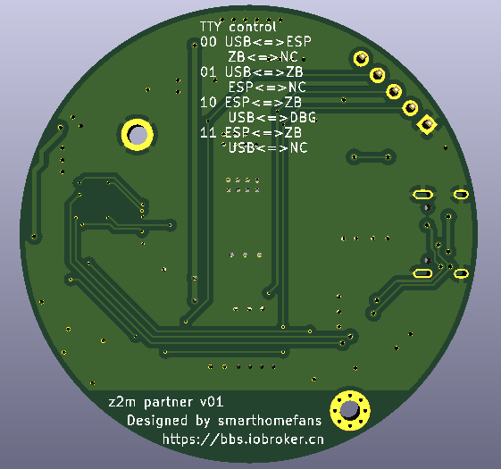

# [中文文档](https://bbs.iobroker.cn/t/topic/882/33)

# z2m hardware module

This is hardware module for [iobroker.zigbee](https://github.com/ioBroker/ioBroker.zigbee) and [zigbee2mqtt](https://github.com/Koenkk/zigbee2mqtt) or [Zigbee to Tasmota](https://github.com/arendst/Tasmota/wiki/Zigbee).  
If you can speak Chinese and be interested with this project, please look at this [post](https://bbs.iobroker.cn/t/topic/882/33) in [ioBroker China BBS](https://bbs.iobroker.cn/)

## **V2P1 version is ready to ship**

## What's the difference

- Use [E18-MS1PA1-IPX](http://www.ebyte.com/en/product-view-news.aspx?id=123) zigbee module. 20dBm power can make sure zigbee net work signal is strong.
- Add an ESP8266 module. Give you another option that can connect zigbee module though wifi-to-serial (I was using this [project](https://github.com/smarthomefans/ESP32-Serial-Bridge)).
If your machine running smarthome platform, such as ioBroker or homeassistant, is put in a hidden corner, for better signal coverage, you can put your zigbee module in some where else.
- ESP8266 connected to E18 firmware download pins, give you a chance that can update E18 though ESP8266, no need to use CC-DEBUG.
- There will be 4 options for different TTY connection:
  - USB TTY <==> ESP 8266 TTY. This option is used for download firmware for E18.
  - USB TTY <==> E18 TTY. If you can connect your module though USB wire, this is more stable.
  - USB TTY <==> ESP 8266 debug port. ESP 8266 TTY <==> E18 TTY. Connect though wifi, and you can capture debug infomation though USB TTY.
  - ESP 8266 TTY <==> E18 TTY. Connect though TTY.

## Hardware module images

## 3D cover

## [SCH](https://github.com/smarthomefans/z2m_partner/raw/master/project/z2m_partner.pdf) preview

## PCB preview

## BOM list
[BOM](https://github.com/smarthomefans/z2m_partner/blob/master/documents/bom.md) can get from here.

## Thanks to

- [modkam](https://modkam.ru/), [kirovilya](https://github.com/kirovilya), [Koenkk](https://github.com/Koenkk).
