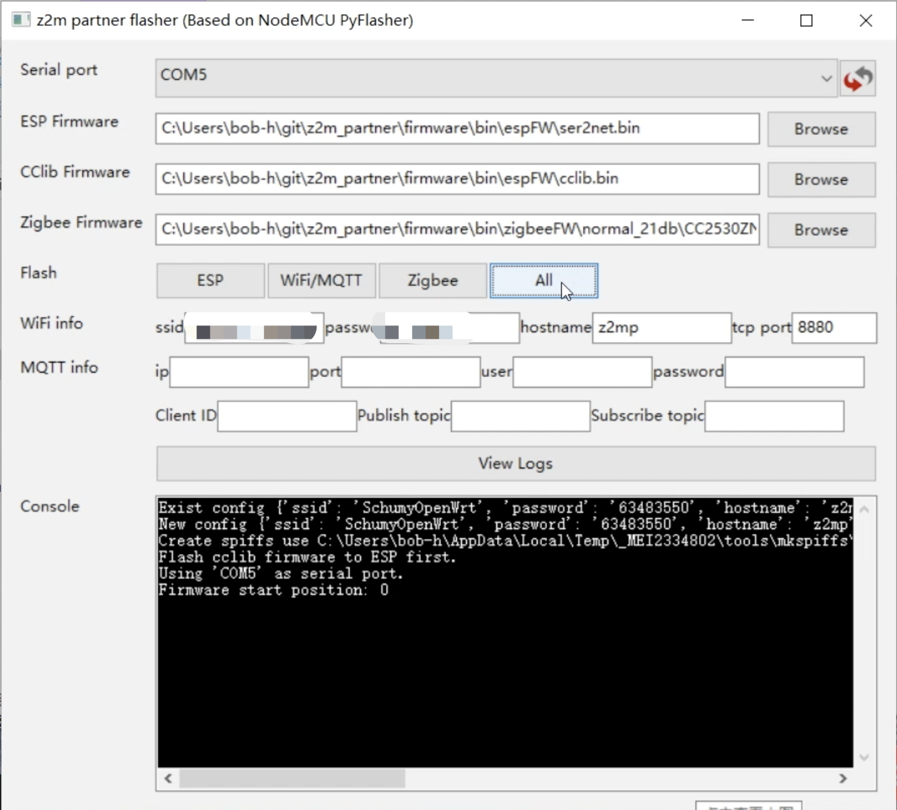

# z2m zigbee网关

此项目是一个开源zigbee网关项目, 所有的硬件和软件都会开放给大家使用. 请大家遵守[CC-BY-SA-4.0](https://github.com/smarthomefans/z2m_partner/blob/master/CC-BY-SA-4.0)协议.

此硬件模组可以结合[iobroker.zigbee](https://github.com/ioBroker/ioBroker.zigbee)项目, [zigbee2mqtt](https://github.com/Koenkk/zigbee2mqtt)项目, [Zigbee to Tasmota](https://github.com/arendst/Tasmota/wiki/Zigbee)项目或者其他开源的基于TI CC2530 zigbee SoC的项目使用.

其他有关这个项目的内容, 可以从[ioBroker China](https://bbs.iobroker.cn/)论坛的[此帖子](https://bbs.iobroker.cn/thread-361-1-1.html)获得, 欢迎大家来一起玩智能家居.

## 声明

- **此项目还处于早期版本**.
- EDA使用[kicad](http://www.kicad-pcb.org/)开发, 不存在软件版权问题.
- DIY硬件有风险, 请大家注意用电安全. 如有风险, 后果自负.

## 项目特点

- 使用[E18-MS1PA1-IPX](http://www.ebyte.com/en/product-view-news.aspx?id=123) zigbee模组, 模组使用CC2592PA, 发射功率可以达到21dBm. 也可以使用[E18-2G4Z27SI](http://www.ebyte.com/en/product-view-news.aspx?id=522)替换pin2pin兼容的[E18-MS1PA1-IPX](http://www.ebyte.com/en/product-view-news.aspx?id=123)模组, 如何设置和实测信号发射功率请参考[此链接](https://github.com/smarthomefans/z2m_partner/blob/master/documents/signal.md).
- 模块自带ESP8266模组. 可以通过WiFi转串口接入智能家居系统, 不再受到主机摆放位置的约束而导致信号覆盖差. 而且可以配合使用[Zigbee to Tasmota](https://github.com/arendst/Tasmota/wiki/Zigbee)项目, 完全不需要上位机, 自己本身就是一个zigbee-wifi网关.
- ESP8266模组和E18模组的CC-DEBUG程序下载引脚连接, 可以通过[CCLib](https://github.com/s-hadinger/CCLib)项目, 直接给E18 zigbee模组下载固件, 不需要另外购买CC-DEBUG在线仿真器.
- 可以通过拨码开关配置多种串口连接方式:
  - USB TTY <==> ESP 8266 TTY. 用于ESP模组和Zigbee模组下载固件.
  - USB TTY <==> E18 TTY. USB直连Zigbee模组, 上位机配置更加简单, 稳定性更强.
  - ESP 8266 TTY <==> E18 TTY. Connect though TTY. ESP模组和Zigbee模组对接, 可以刷WiFi串口固件, 实现WiFi接入上位机智能家居系统, 具体方法参考[此链接](#%e5%88%b7%e6%9c%ba%e6%95%99%e7%a8%8b). 或者直接配合[Zigbee to Tasmota](https://github.com/arendst/Tasmota/wiki/Zigbee)项目做独立的Zigbee网关.
  - USB TTY <==> ESP 8266 debug port. ESP 8266 TTY <==> E18 TTY. 和上一种连接方式一样, 多增加了一个debug串口.
- 使用USB **Type-C**接口. 紧跟时代潮流.
- 不管你怎么看, 我认为这个比USB dongle要好看几个数量级. 颜值即正义.

## 硬件图片

## 3D打印外壳

## PCB预览

## BOM单

### 做WiFi/USB有线接入的Zigbee网关

名称|封装|数值|数量|标号|立创商城货号
---|---|---|---|---|---
贴片钽电容|TypeB|10uF|2|C5, C6|[C128257](https://item.szlcsc.com/139542.html)
贴片电容|0603|100nF|3|C3, C4, C7|[C149620](https://item.szlcsc.com/160954.html)
贴片LED灯|1206|LED|1|D1|[C99881](https://item.szlcsc.com/101095.html)
自恢复限流保险|1812|MF-MSMF050|1|F1|[C17313](https://item.szlcsc.com/17998.html)
贴片电阻|0603|5.1k|2|R1, R2|[C26000](https://item.szlcsc.com/26743.html)
贴片电阻|0603|10k|6|R3, R4, R7, R10-R12|[C15401](https://item.szlcsc.com/16079.html)
贴片电阻|0603|0|1|R8|[C384298](https://item.szlcsc.com/357579.html)
贴片电阻|0603|1k|1|R9|[C21190](https://item.szlcsc.com/21904.html)
拨码开关|SMT_P1.27mm|2位|1|SW1|[C40735](https://item.szlcsc.com/41719.html)
微动开关|SW_SPST_PTS810|SW_Push|2|SW2, SW3|[C221896](https://item.szlcsc.com/222326.html)
USB串口芯片|SOP16|CH340C|1|U1|[C84681](https://item.szlcsc.com/85852.html)
模拟开关芯片|SOP16|CD4052B|1|U2|[C6521](https://item.szlcsc.com/6986.html)
Zigbee模块|E18-MS1PA1-IPX|E18-MS1PA1-IPX|1|U3|[C108551](https://item.szlcsc.com/109770.html)
模拟开关芯片|SOT-353|74LVC1G66|2|U4, U5|[C113518](https://list.szlcsc.com/catalog/488.html)
低压差线性稳压器|SOT-223-3|1117-33|1|U6|[C369933](https://list.szlcsc.com/catalog/387.html)
WiFi模块|ESP-WROOM-02|ESP-WROOM-02|1|U7|[C81770](https://item.szlcsc.com/82923.html)
SMA转I-PEX|||1||[C403729](https://item.szlcsc.com/389816.html)
TypeC座|||1||[C165948](https://item.szlcsc.com/177331.html)

参考价格来自立创商城. 加上PCB成本, 总计成本约**61.236**元.

## 刷机教程

### 准备材料

- windows电脑一台
- usb typeC数据线一条(数据线, 别弄一个充电线过来)
- z2m网关硬件V01版本一个, 将USB串口配置到ESP模块上. 请[参考](https://github.com/smarthomefans/z2m_partner/blob/master/documents/tty.md).
- 刷机所需要的[固件](https://github.com/smarthomefans/z2m_partner/archive/master.zip). [源码](https://github.com/smarthomefans/z2m_partner/tree/master/firmware/esp)也在本项目中.
- 专门为此项目开发的[刷机工具](https://github.com/smarthomefans/esphome-flasher/releases/download/0.1.0/ESPHome-Flasher.exe)
- 空闲的**30**分钟(不夸张, 真的很久)

### 刷机过程

1. 打开刷机工具, 选择固件, 配置个人的wifi, 设备hostname以及tcp串口的串口号. (MQTT相关的信息还没有测试).

1. **按住设备的flash按钮, 同时点一下reset按钮**. 让ESP模块进入刷机模式.
1. 点击刷机工具的**All**图标.
1. 此阶段正在给ESP模块刷cclib固件, 为下一阶段给zigbee模块刷机做准备(用时大约30秒).
1. 注意console界面, 出现`Please press reset button`的5秒倒计时时, 要按一下模块的reset按钮.
1. 接下来程序将给zigbee刷固件, 耗时**20**分钟!!!!(该喝茶, 该买咖啡买咖啡, 注意到点回来就行)
1. 刷完zigbee固件后, 需要再次让ESP模块进入刷机模式, **按住设备的flash按钮, 同时点一下reset按钮**. 刷ESP wifi串口固件(用时约30秒).
1. 刷完后还需要让ESP模块进入刷机模式, **按住设备的flash按钮, 同时点一下reset按钮**. 刷WiFi等配置信息(用时5秒).

### 注意事项

- 因为V01版本的ESP刷机模式做的不是很好, 还需要在特定时间手动按按钮, 所以一定要熟悉整个流程, 在关键时刻出手. 如果刷机失败, 拔掉USB线, 从头来过. (V02版本硬件应该会做到自动化).
- Zigbee刷机真的要很长时间, 也可以用TI的SBL工具刷机.
- 用刷机工具刷机, Zigbee固件要选择**hex**后缀的固件. 使用TI SBL工具刷机才使用**bin**后缀的固件.
- Zigbee固件CC2530ZNP-SB.hex是SBL的bootloader. normal_21db文件夹下面是normal模式的固件(推荐就用这个吧, 小米设备支持更好). source_routing_21db文件夹下面是支持source_routing的固件(这个功能小米的设备支持不好, 总有很多错误log).

### 刷机视频

可以从[这里]()看一下刷机视频, 熟悉一下操作流程.

## 改版计划

- [x] USB串口芯片自动控制ESP flash和reset引脚, 无需再按键.
- [x] LED灯交给ESP芯片控制, 可调节开关和显示效果.
- [x] 优化拨码开关的丝印提示.
- 可能更新CC2538模组(30%可能性吧).

## 致谢

- 各位大佬[modkam](https://modkam.ru/), [kirovilya](https://github.com/kirovilya), [Koenkk](https://github.com/Koenkk).
- 小F, 帮忙设计“碉堡”的外壳.
- 萝卜哥, 花神以及热爱智能家居的每一位.

如果您使用了本项目并且感觉不错, 请打赏一杯咖啡钱吧~

