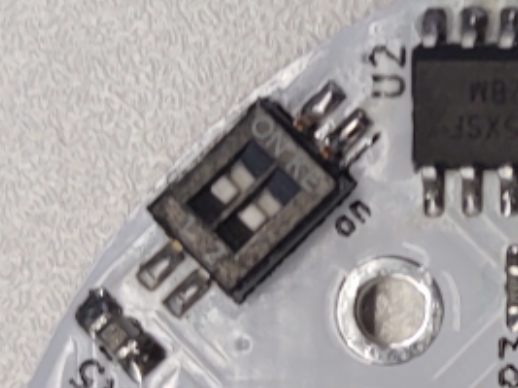

# Z2M USB串口复用控制

## V01版本

### 开关名称和状态定义

- 定义开关为上、下两个开关.
- 开关分别有左、右两种状态.
(就是别看板子上的丝印了)

### 工作模式对照表

\\|上左|上右
---|---|---
下左|ESP连Zigbee, USB串口没有输出|ESP连Zigbee, USB串口输出调试信息
下右|USB串口连接Zigbee|USB串口连接ESP

## V02版本(未测试)

此版本目的是要不需要用户控制, 完全用ESP模块来控制串口复用状态.
所以, 请不焊接SW1, R13, R14, R3, R4.  
如果焊接了SW1, 也别焊接R3, R4, 并且保持SW1的两个开关都处于左测.
